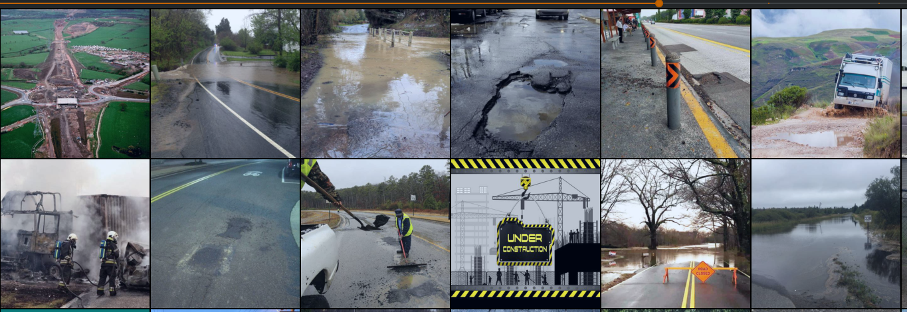
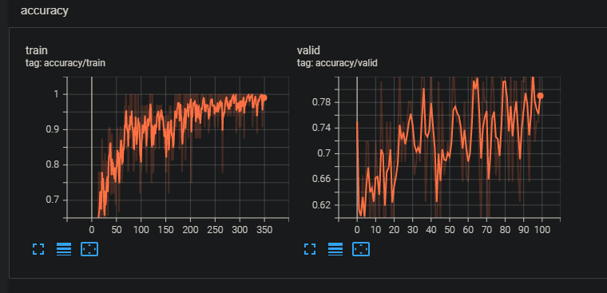
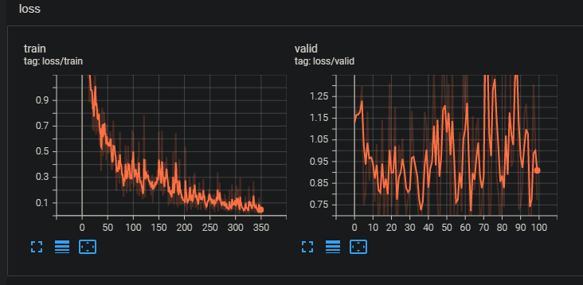
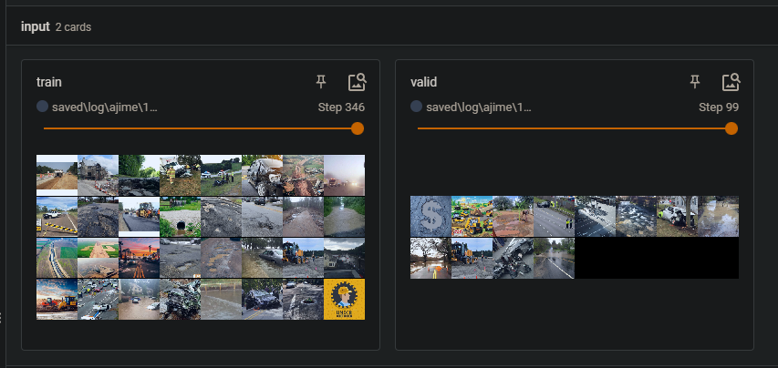

# ajime



[](https://github.com/ambv/black)

## What is this?

> Still me goofing around.

**Seriously what is this?**

this is classifier trained on very few images scraped from duckduck go.

## What does it classify?

- Potholes
- Dumping
- Accidents
- Flooded
- Bad drainage
- Construction

Yeah I know they don't make much sense but .....

### Companion repo

- [mrdvince/mime](https://github.com/mrdvince/mime)

This has all the "stitched up" code for the whole thing.

## Training graphs and logs

> A small dataset was used, more of a base line and less of perfomance and accuracy oriented.



Some training losses.



Inputs (train, valid)



# Getting Started

## Dependencies

To set up your python environment to run the code in this repository, follow the instructions below.

1. Create (and activate) a new environment with Python 3.6. - **Linux** or **Mac**:
   `bash conda create --name py39 python=3.9.7 conda activate py39 `
   alternatively, use virtual environments if you don't have Anaconda installed.

2. Clone the repository (if you haven't already!), and navigate to the `anga` folder. Then, install several dependencies.

```bash
git clone https://github.com/mrdvince/ajime
cd ajime
```

3. Requirements

Install requirememts in the rquirements.txt file

```bash
pip install -r requirements.txt
```

4. Images (Dataset)

cd into the data folder and open the images notebook

> feel free to change the classes to whichever ones you like

executing the cells will download images from duckduckgo and store them in the data folder

5. Training

Modify the dataloader and the model classes and use a model definition of your choosing.

Update the `config.json` file and include the model and dataloader class names.

Finally run:

```bash
python train.py -c confi.json
```

## Folder structure

Head over to this [repo](https://github.com/mrdvince/pytorch_template) to get an overview of the folder structure and file name descriptions.
